# Portfolio Snapshots

This repository is to show cases of private projects I've worked before

## Table of Contents

- [Hive Geospatial](#HiveGeospatial)
- [Sakura Fu Sushi](#SakuraFuSushi)
- [Jewelry SaintJohn](#JewelrySaintJohn)
- [FLCos2](#FLCos2)
- [FLCos](#FLCos)

## HivesGeospatial

Tech:

[maplibre](https://maplibre.org/), [D3](https://observablehq.com/@d3/gallery)

Display:

## SakuraFuSushi

Website:
[Sakura Fu Sushi](https://sakurafusushi.com)

Tech:

[Chakra UI](https://chakra-ui.com/)

Display:

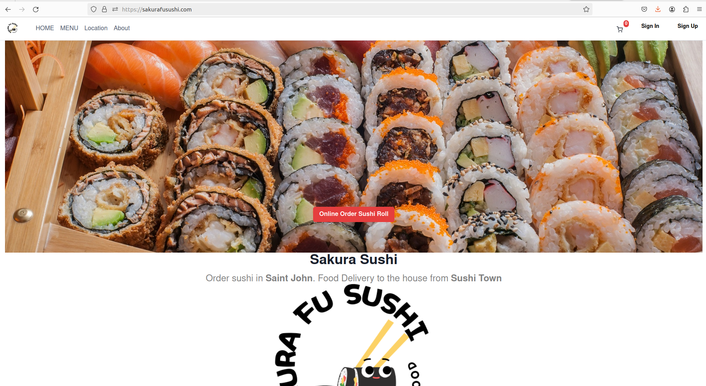

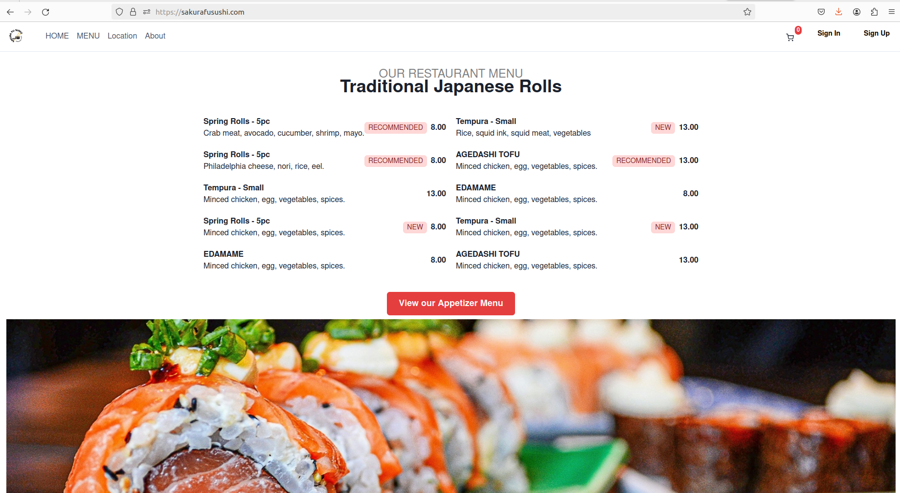

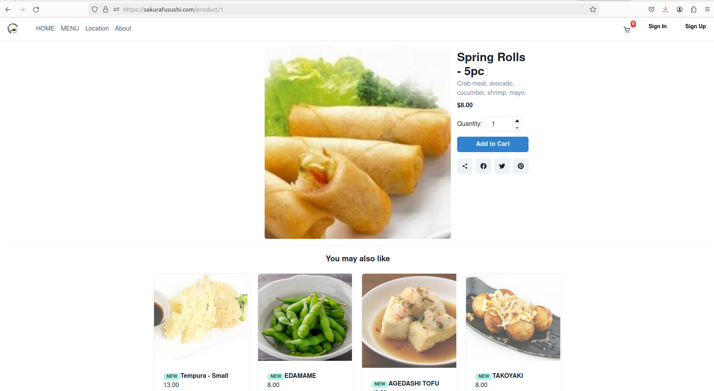

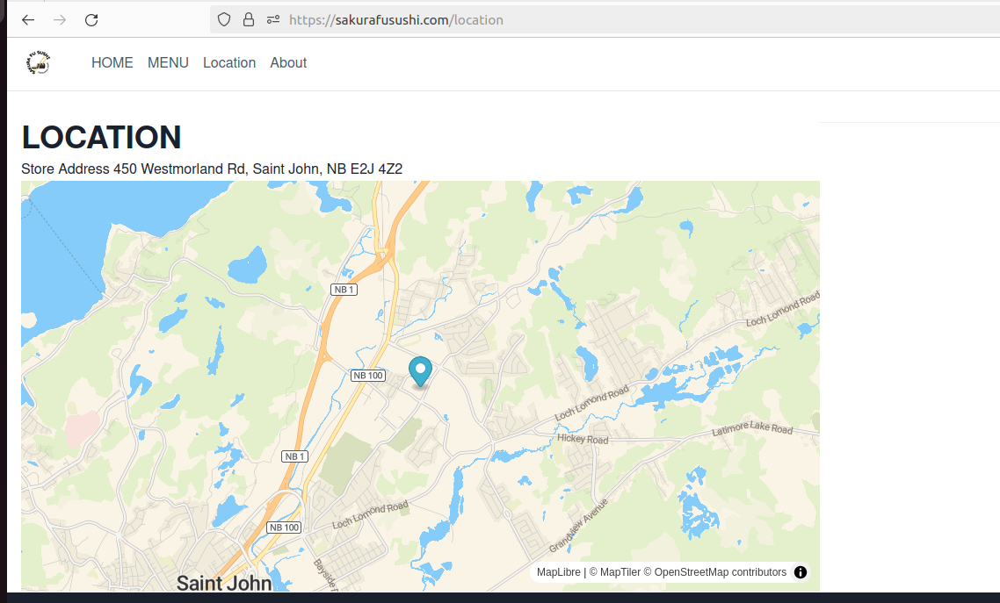

## JewelrySaintJohn

Website:
[Jewelry Saint John](https://sakurafushi.com)

## FLCos2

Website:

[FLCos2](https://lhf552004.github.io/flcos2/)

This project utilizes Angular, Spring Boot, and OPC UA. It is a personal initiative and I am open to discussions and potential collaborations.

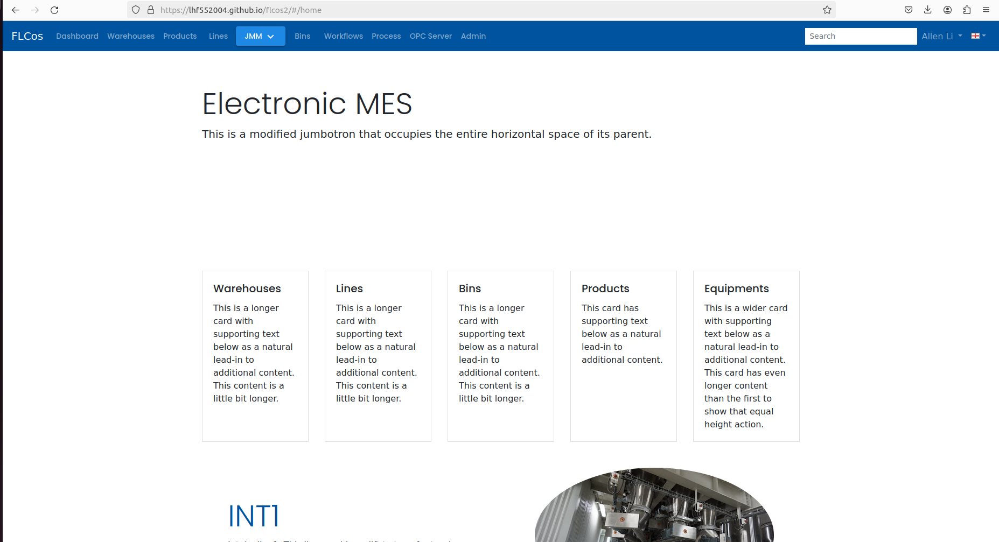

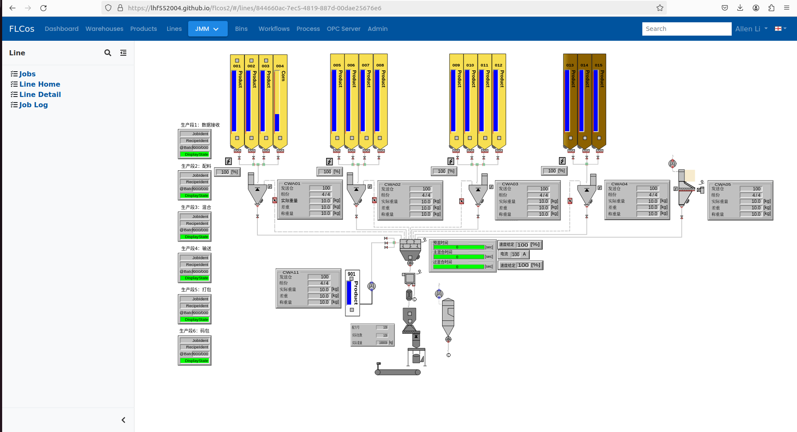

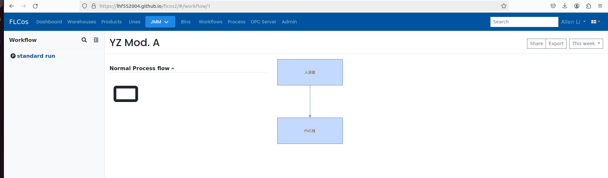

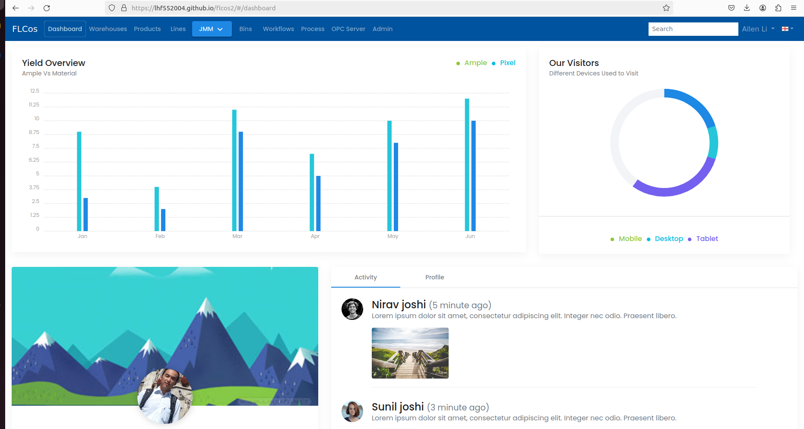

## FLCos

[FLCos](https://flcos.github.io/)

This project utilizes Nodejs, Express, and OPC UA. It is a personal initiative and I am open to discussions and potential collaborations.

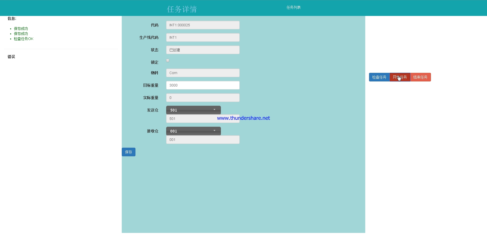

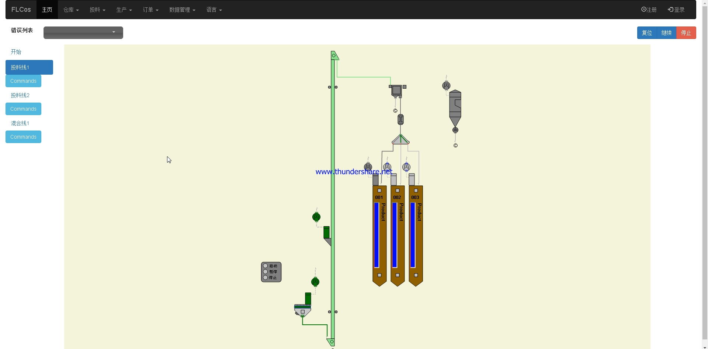

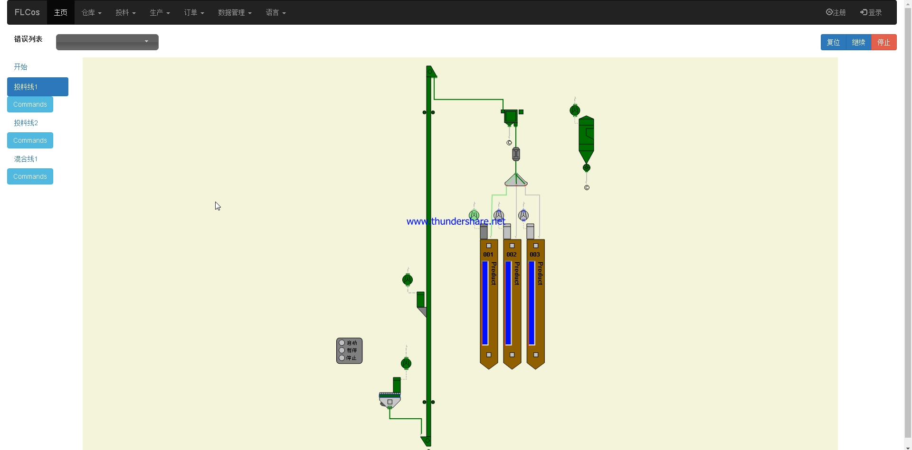
