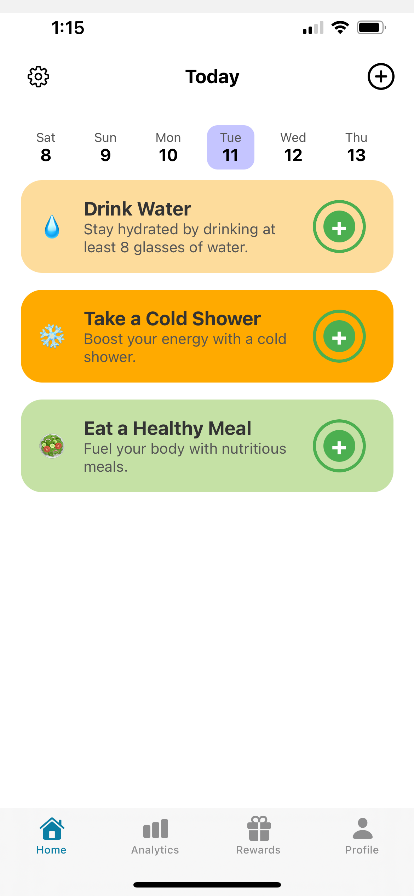
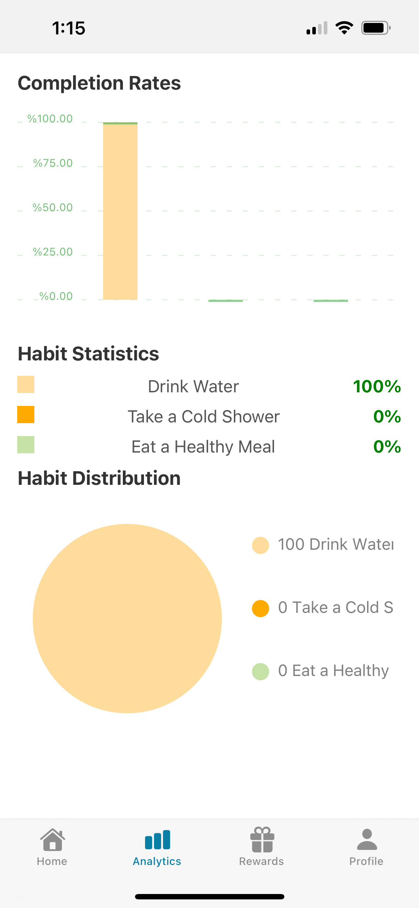
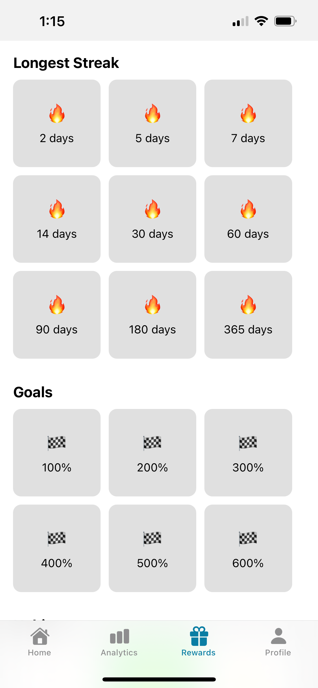
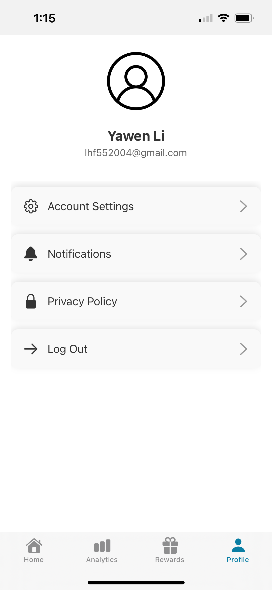

# Portfolio Snapshots

This repository is to show cases of private projects I've worked before

## Table of Contents

- [Hive Geospatial](#HiveGeospatial)
- [Sakura Fu Sushi](#SakuraFuSushi)
- [Daily Habits App](#DailyHabitsApp)
- [Jewelry SaintJohn](#JewelrySaintJohn)
- [FLCos2](#FLCos2)
- [FLCos](#FLCos)

## HivesGeospatial

Website:

[Hive Dev](https://dev.hivegeospatial.app/)

## SakuraFuSushi

Website:
[Sakura Fu Sushi](https://sakurafusushi.com)

I have developed a online shop system that can easily be reused by generating the menu through the project's included tool.

It has online order, order auto print, confirmatin email to customer, order management modules

Feel free to contact us if you're interested in deploying websites for your business. [lhf552004@gmail.com](mailto:lhf552004@gmail.com)

Display:

## DailyHabitsApp

This is mobile app using Expo and React Native.

## JewelrySaintJohn

Website:
[Jewelry Saint John](https://sakurafushi.com)

This is another application with the same template.

## FLCos2

Website:

[FLCos2](https://lhf552004.github.io/flcos2/)

This project utilizes Angular, Spring Boot, and OPC UA. It is a personal initiative and I am open to discussions and potential collaborations.

[lhf552004@gmail.com](mailto:lhf552004@gmail.com)

## FLCos

[FLCos](https://flcos.github.io/)

This project utilizes Nodejs, Express, and OPC UA. It is a personal initiative and I am open to discussions and potential collaborations. [lhf552004@gmail.com](mailto:lhf552004@gmail.com)

